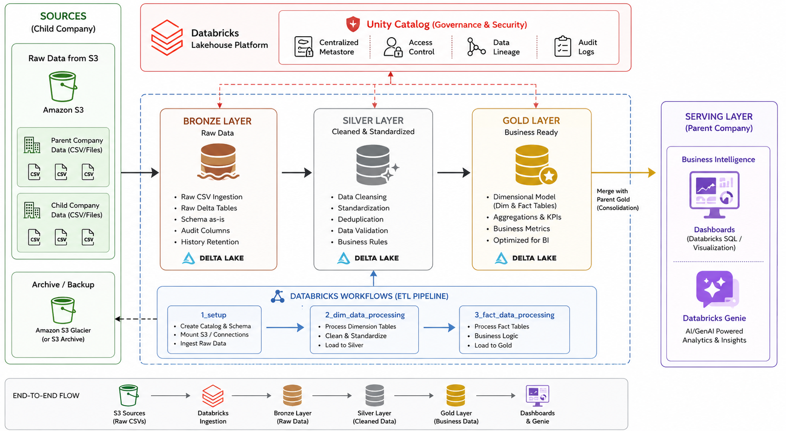
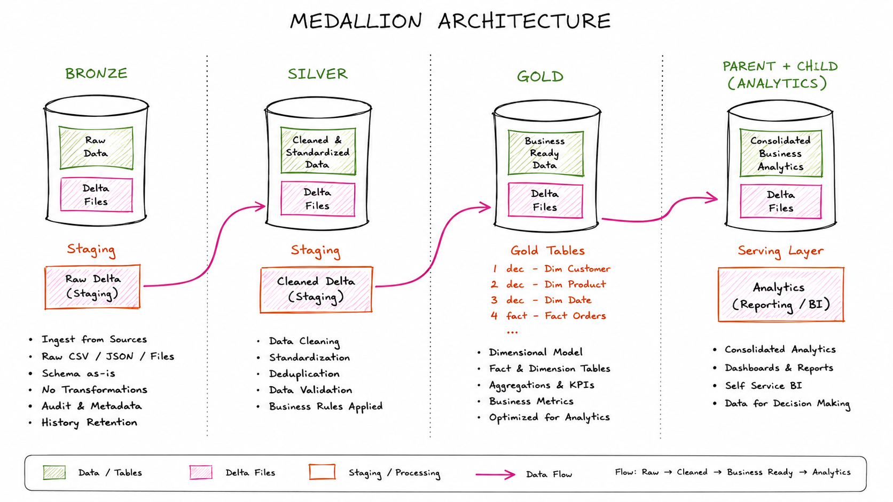

<div align="center">

# 🛒 FMCG Retail Merger Data Lakehouse

### *An End-to-End Data Engineering Project on Databricks*

[]()
[]()
[]()
[]()
[]()
[]()

### 🚀 Building a Unified Enterprise Lakehouse Following a Retail Acquisition

*This project demonstrates how modern Data Engineering practices can consolidate heterogeneous datasets from two retail organizations into a single governed Lakehouse architecture, enabling enterprise reporting, business intelligence, and AI-powered analytics.*

---



</div>

---

# 📚 Table of Contents

* [📖 Project Overview](#-project-overview)
* [🏢 Business Problem](#-business-problem)
* [💡 Solution Overview](#-solution-overview)
* [🏗 Solution Architecture](#-solution-architecture)
* [🥉 Medallion Architecture](#-medallion-architecture)
* [🛠 Technology Stack](#-technology-stack)
* [📂 Repository Structure](#-repository-structure)
* [🛡 Enterprise Data Quality & Standardization](#-enterprise-data-quality--standardization)
* ETL Pipeline *(Part 2)*
* Gold Layer Data Model *(Part 2)*
* Dashboards *(Part 2)*
* Databricks Genie *(Part 2)*
* Documentation *(Part 2)*
* Future Enhancements *(Part 2)*

---

# 📖 Project Overview

Modern retail organizations often expand through mergers and acquisitions. While these acquisitions create new business opportunities, they also introduce significant challenges in consolidating operational and analytical data.

**FMCG Retail Merger Data Lakehouse** is an end-to-end Data Engineering project built on the **Databricks Lakehouse Platform** that simulates a real-world acquisition scenario in the FMCG industry.

The project demonstrates how two organizations with different reporting structures, schemas, and business rules can be integrated into a unified enterprise analytics platform using the **Medallion Architecture**.

The pipeline ingests raw datasets from both organizations, performs extensive cleansing and standardization, harmonizes inconsistent reporting granularities, and produces trusted Gold-layer datasets that power executive dashboards and natural language analytics through Databricks Genie.

---

# 🏢 Business Problem

Following the acquisition of **Company B** by **Company A**, the organization faced a major challenge in consolidating business data for enterprise reporting.

Although both companies operated in the FMCG retail sector, their operational systems were designed independently, resulting in incompatible data architectures.

### Key Challenges

| Company A                 | Company B                 |
| ------------------------- | ------------------------- |
| Monthly Sales Data        | Daily Transaction Data    |
| Monthly Pricing           | Daily Orders              |
| Different Product Catalog | Different Product Catalog |
| Independent Dashboards    | Independent Dashboards    |

The primary challenges included:

* Different reporting granularities (monthly vs. daily)
* Inconsistent customer and product schemas
* Different business rules and identifiers
* Fragmented reporting environments
* Multiple versions of business KPIs
* No centralized analytical platform

As a result, business users were unable to generate reliable enterprise-wide insights across the merged organization.

---

# 💡 Solution Overview

To address these challenges, an enterprise-scale Lakehouse solution was implemented using Databricks.

The solution follows the **Medallion Architecture**, progressively transforming raw operational data into trusted analytical datasets.

### High-Level Workflow

```text
Company A (Monthly Data)
                │
                │
Company B (Daily Data)
                │
                ▼
          Amazon S3
                │
                ▼
          Bronze Layer
      Raw Delta Tables
                │
                ▼
          Silver Layer
 Schema Standardization
 Data Cleansing
 Data Harmonization
                │
                ▼
           Gold Layer
 Enterprise Data Model
                │
      ┌─────────┴─────────┐
      ▼                   ▼
 Dashboards       Databricks Genie
```

The final solution establishes a **single source of truth** for enterprise reporting while ensuring scalability, governance, and high data quality.

---

# 🏗 Solution Architecture

<div align="center">


</div>

The architecture follows a modern Lakehouse design pattern.

### Data Flow

1. Parent and child company datasets are ingested from Amazon S3.
2. Raw data is persisted in the Bronze layer.
3. The Silver layer performs cleansing, validation, schema standardization, and harmonization.
4. The Gold layer creates consolidated analytical datasets optimized for reporting.
5. Dashboards and Databricks Genie consume the Gold layer to provide business insights.

---

# 🥉 Medallion Architecture

<div align="center">



</div>

## Bronze Layer

The Bronze layer serves as the raw landing zone for all incoming datasets.

**Responsibilities**

* Raw data ingestion
* Historical data preservation
* Source traceability
* Delta table creation

---

## Silver Layer

The Silver layer transforms raw operational data into trusted business entities.

**Responsibilities**

* Schema standardization
* Data cleansing
* Invalid record filtering
* Duplicate removal
* Daily-to-monthly harmonization
* Business rule implementation
* Parent–child data consolidation

---

## Gold Layer

The Gold layer provides enterprise-ready datasets optimized for analytical workloads.

**Responsibilities**

* Dimension table creation
* Fact table generation
* Enterprise analytical views
* Dashboard-ready datasets
* AI-ready datasets for Databricks Genie

---

# 🛠 Technology Stack

| Category                   | Technology              |
| -------------------------- | ----------------------- |
| **Platform**               | Databricks Free Edition |
| **Programming Language**   | Python                  |
| **Distributed Processing** | Apache Spark            |
| **Query Engine**           | Spark SQL               |
| **Cloud Storage**          | Amazon S3               |
| **Storage Format**         | Delta Lake              |
| **Data Governance**        | Unity Catalog           |
| **Architecture Pattern**   | Medallion Architecture  |
| **Data Modeling**          | Dimensional Modeling    |
| **Visualization**          | Databricks Dashboards   |
| **AI Analytics**           | Databricks Genie        |
| **Version Control**        | Git & GitHub            |

---

# 📂 Repository Structure

```text
fmcg-retail-merger-data-lakehouse/

├── architecture/
│   ├── solution_architecture.png
│   ├── medallion_architecture.png
│   └── dimensional_model.png
│
├── dashboards/
│
├── docs/
│   ├── business-problem.md
│   ├── project-overview.md
│   ├── dimensional-model.md
│   └── setup-guide.md
│
├── genie/
│
├── notebooks/
│   ├── 1_setup/
│   ├── 2_dim_data_processing/
│   └── 3_fact_data_processing/
│
├── sql/
│
├── README.md
└── LICENSE
```

---

# 🛡 Enterprise Data Quality & Standardization

High-quality data is fundamental to accurate business reporting. During the **Silver layer**, the pipeline performs comprehensive validation and standardization to ensure that only trusted data is promoted to the Gold layer.

### Data Quality Operations

* ✅ Schema validation
* ✅ Invalid record detection
* ✅ Invalid record filtering
* ✅ Duplicate removal
* ✅ Mandatory field validation
* ✅ Data cleansing
* ✅ Standardization of customer attributes
* ✅ Standardization of product attributes
* ✅ Business rule enforcement
* ✅ Parent–child data harmonization

### Business Benefits

* 📊 Accurate enterprise reporting
* 📈 Reliable business KPIs
* 👥 Consistent customer data
* 📦 Standardized product catalog
* 💰 Trusted analytical datasets
* 🚀 Improved decision-making
* 🔍 Enhanced data integrity

---

<div align="center">

# 🛒 FMCG Retail Merger Data Lakehouse

### *An End-to-End Data Engineering Project on Databricks*

[]()
[]()
[]()
[]()
[]()
[]()

### 🚀 Building a Unified Enterprise Lakehouse Following a Retail Acquisition

*This project demonstrates how modern Data Engineering practices can consolidate heterogeneous datasets from two retail organizations into a single governed Lakehouse architecture, enabling enterprise reporting, business intelligence, and AI-powered analytics.*

---


</div>

---

# 📚 Table of Contents

* [📖 Project Overview](#-project-overview)
* [🏢 Business Problem](#-business-problem)
* [💡 Solution Overview](#-solution-overview)
* [🏗 Solution Architecture](#-solution-architecture)
* [🥉 Medallion Architecture](#-medallion-architecture)
* [🛠 Technology Stack](#-technology-stack)
* [📂 Repository Structure](#-repository-structure)
* [🛡 Enterprise Data Quality & Standardization](#-enterprise-data-quality--standardization)
* ETL Pipeline *(Part 2)*
* Gold Layer Data Model *(Part 2)*
* Dashboards *(Part 2)*
* Databricks Genie *(Part 2)*
* Documentation *(Part 2)*
* Future Enhancements *(Part 2)*

---

# 📖 Project Overview

Modern retail organizations often expand through mergers and acquisitions. While these acquisitions create new business opportunities, they also introduce significant challenges in consolidating operational and analytical data.

**FMCG Retail Merger Data Lakehouse** is an end-to-end Data Engineering project built on the **Databricks Lakehouse Platform** that simulates a real-world acquisition scenario in the FMCG industry.

The project demonstrates how two organizations with different reporting structures, schemas, and business rules can be integrated into a unified enterprise analytics platform using the **Medallion Architecture**.

The pipeline ingests raw datasets from both organizations, performs extensive cleansing and standardization, harmonizes inconsistent reporting granularities, and produces trusted Gold-layer datasets that power executive dashboards and natural language analytics through Databricks Genie.

---

# 🏢 Business Problem

Following the acquisition of **Company B** by **Company A**, the organization faced a major challenge in consolidating business data for enterprise reporting.

Although both companies operated in the FMCG retail sector, their operational systems were designed independently, resulting in incompatible data architectures.

### Key Challenges

| Company A                 | Company B                 |
| ------------------------- | ------------------------- |
| Monthly Sales Data        | Daily Transaction Data    |
| Monthly Pricing           | Daily Orders              |
| Different Product Catalog | Different Product Catalog |
| Independent Dashboards    | Independent Dashboards    |

The primary challenges included:

* Different reporting granularities (monthly vs. daily)
* Inconsistent customer and product schemas
* Different business rules and identifiers
* Fragmented reporting environments
* Multiple versions of business KPIs
* No centralized analytical platform

As a result, business users were unable to generate reliable enterprise-wide insights across the merged organization.

---

# 💡 Solution Overview

To address these challenges, an enterprise-scale Lakehouse solution was implemented using Databricks.

The solution follows the **Medallion Architecture**, progressively transforming raw operational data into trusted analytical datasets.

### High-Level Workflow

```text
Company A (Monthly Data)
                │
                │
Company B (Daily Data)
                │
                ▼
          Amazon S3
                │
                ▼
          Bronze Layer
      Raw Delta Tables
                │
                ▼
          Silver Layer
 Schema Standardization
 Data Cleansing
 Data Harmonization
                │
                ▼
           Gold Layer
 Enterprise Data Model
                │
      ┌─────────┴─────────┐
      ▼                   ▼
 Dashboards       Databricks Genie
```

The final solution establishes a **single source of truth** for enterprise reporting while ensuring scalability, governance, and high data quality.

---

# 🏗 Solution Architecture

<div align="center">


</div>

The architecture follows a modern Lakehouse design pattern.

### Data Flow

1. Parent and child company datasets are ingested from Amazon S3.
2. Raw data is persisted in the Bronze layer.
3. The Silver layer performs cleansing, validation, schema standardization, and harmonization.
4. The Gold layer creates consolidated analytical datasets optimized for reporting.
5. Dashboards and Databricks Genie consume the Gold layer to provide business insights.

---

# 🥉 Medallion Architecture

<div align="center">


</div>

## Bronze Layer

The Bronze layer serves as the raw landing zone for all incoming datasets.

**Responsibilities**

* Raw data ingestion
* Historical data preservation
* Source traceability
* Delta table creation

---

## Silver Layer

The Silver layer transforms raw operational data into trusted business entities.

**Responsibilities**

* Schema standardization
* Data cleansing
* Invalid record filtering
* Duplicate removal
* Daily-to-monthly harmonization
* Business rule implementation
* Parent–child data consolidation

---

## Gold Layer

The Gold layer provides enterprise-ready datasets optimized for analytical workloads.

**Responsibilities**

* Dimension table creation
* Fact table generation
* Enterprise analytical views
* Dashboard-ready datasets
* AI-ready datasets for Databricks Genie

---

# 🛠 Technology Stack

| Category                   | Technology              |
| -------------------------- | ----------------------- |
| **Platform**               | Databricks Free Edition |
| **Programming Language**   | Python                  |
| **Distributed Processing** | Apache Spark            |
| **Query Engine**           | Spark SQL               |
| **Cloud Storage**          | Amazon S3               |
| **Storage Format**         | Delta Lake              |
| **Data Governance**        | Unity Catalog           |
| **Architecture Pattern**   | Medallion Architecture  |
| **Data Modeling**          | Dimensional Modeling    |
| **Visualization**          | Databricks Dashboards   |
| **AI Analytics**           | Databricks Genie        |
| **Version Control**        | Git & GitHub            |

---

# 📂 Repository Structure

```text
fmcg-retail-merger-data-lakehouse/

├── architecture/
│   ├── solution_architecture.png
│   ├── medallion_architecture.png
│   └── dimensional_model.png
│
├── dashboards/
│
├── docs/
│   ├── business-problem.md
│   ├── project-overview.md
│   ├── dimensional-model.md
│   └── setup-guide.md
│
├── genie/
│
├── notebooks/
│   ├── 1_setup/
│   ├── 2_dim_data_processing/
│   └── 3_fact_data_processing/
│
├── sql/
│
├── README.md
└── LICENSE
```

---

# 🛡 Enterprise Data Quality & Standardization

High-quality data is fundamental to accurate business reporting. During the **Silver layer**, the pipeline performs comprehensive validation and standardization to ensure that only trusted data is promoted to the Gold layer.

### Data Quality Operations

* ✅ Schema validation
* ✅ Invalid record detection
* ✅ Invalid record filtering
* ✅ Duplicate removal
* ✅ Mandatory field validation
* ✅ Data cleansing
* ✅ Standardization of customer attributes
* ✅ Standardization of product attributes
* ✅ Business rule enforcement
* ✅ Parent–child data harmonization

### Business Benefits

* 📊 Accurate enterprise reporting
* 📈 Reliable business KPIs
* 👥 Consistent customer data
* 📦 Standardized product catalog
* 💰 Trusted analytical datasets
* 🚀 Improved decision-making
* 🔍 Enhanced data integrity

---

<div align="center">

### 📖 Continue to **Part 2**

**ETL Pipeline • Gold Layer Data Model • Dashboards • Databricks Genie • Documentation • Future Enhancements**

</div>
---

# ⚙️ ETL Pipeline

The project implements a scalable **Extract, Transform, Load (ETL)** pipeline using the **Databricks Lakehouse Platform** and follows the Medallion Architecture to progressively refine raw operational data into analytics-ready datasets.

<div align="center">

```text
                 Company A
             (Monthly Data)
                    │
                    │
                 Amazon S3
                    ▲
                    │
                 Company B
              (Daily Data)

                    │
                    ▼

        🥉 Bronze Layer
      Raw Delta Tables

                    │

                    ▼

        🥈 Silver Layer
   Data Cleansing
   Schema Standardization
   Invalid Record Filtering
   Parent–Child Harmonization

                    │

                    ▼

        🥇 Gold Layer
  Fact & Dimension Tables
  Analytical Views

                    │

        ┌───────────┴───────────┐

        ▼                       ▼

 Databricks Dashboards    Databricks Genie
```

</div>

---

## 🔄 Pipeline Execution

The notebooks are executed sequentially.

| Stage                      | Purpose                                                     |
| -------------------------- | ----------------------------------------------------------- |
| **1_setup**                | Configure the Lakehouse environment and ingest raw datasets |
| **2_dim_data_processing**  | Create standardized dimension tables                        |
| **3_fact_data_processing** | Build fact tables and analytical views                      |

---

## 📌 Pipeline Features

* Automated ETL workflow
* Parent–Child company consolidation
* Schema harmonization
* Data quality validation
* Delta Lake processing
* Gold layer optimization
* Enterprise reporting readiness

---

# ⭐ Gold Layer Data Model

<div align="center">


</div>

The Gold layer follows a **dimensional modeling approach** designed for analytical workloads.

It consists of reusable **dimension tables**, transactional **fact tables**, and enriched analytical views that power enterprise reporting.

---

## 📦 Dimension Tables

| Table               | Description                       |
| ------------------- | --------------------------------- |
| **dim_customers**   | Standardized customer information |
| **dim_products**    | Product master data               |
| **dim_date**        | Calendar dimension                |
| **dim_gross_price** | Product pricing information       |

---

## 🛒 Fact Table

| Table           | Description                           |
| --------------- | ------------------------------------- |
| **fact_orders** | Consolidated transactional sales data |

---

## 📊 Analytical View

The project exposes an enriched analytical view that combines multiple business entities into a reporting-ready dataset.

This view is consumed by:

* Databricks Dashboards
* Databricks Genie
* Business users

---

# 📊 Business Intelligence Dashboards

The Gold Layer powers interactive dashboards that enable business users to monitor organizational performance after the merger.

<div align="center">

*(Replace with dashboard screenshots)*


</div>

---

## Dashboard Capabilities

* Revenue Overview
* Sales Trends
* Top Products
* Top Customers
* Revenue by Channel
* Product Performance
* Customer Analytics
* Executive KPIs

---

## Business Value

The dashboards provide a unified view of the merged organization, enabling stakeholders to analyze performance from a single trusted source instead of relying on multiple independent reporting systems.

---

# 🤖 AI-Powered Analytics with Databricks Genie

The consolidated Gold Layer is exposed to **Databricks Genie**, enabling business users to interact with enterprise data using natural language.

<div align="center">

*(Replace with Genie screenshots)*


</div>

---

## Example Business Questions

* What is the total revenue this year?
* Show the top 10 products by revenue.
* Which customer generated the highest revenue?
* Compare revenue by sales channel.
* Show monthly sales trends.
* Which products contributed the highest sales?

---

## Benefits

* Natural language querying
* Self-service analytics
* Faster business insights
* Reduced dependency on SQL
* Improved accessibility for non-technical users

---

# 📚 Documentation

Detailed documentation is available in the **docs/** directory.

| Document                 | Description                               |
| ------------------------ | ----------------------------------------- |
| **business-problem.md**  | Business context and acquisition scenario |
| **project-overview.md**  | Architecture and project overview         |
| **dimensional-model.md** | Gold layer dimensional model              |
| **setup-guide.md**       | Deployment and execution guide            |

---

# 🌟 Project Highlights

## Data Engineering

* End-to-End ETL Pipeline
* Medallion Architecture
* Delta Lake
* Apache Spark
* Spark SQL
* Amazon S3
* Unity Catalog

---

## Data Modeling

* Enterprise Dimensional Modeling
* Fact & Dimension Tables
* Gold Layer Optimization
* Analytical Views

---

## Data Quality

* Schema Validation
* Invalid Record Filtering
* Duplicate Removal
* Data Cleansing
* Business Rule Validation
* Parent–Child Data Harmonization

---

## Analytics

* Interactive Dashboards
* Business KPIs
* Executive Reporting
* Databricks Genie
* Natural Language Analytics

---

# 🚀 Future Enhancements

The current implementation can be extended with additional enterprise capabilities.

### Planned Improvements

* Auto Loader for incremental ingestion
* Change Data Capture (CDC)
* Streaming pipelines using Structured Streaming
* Delta Live Tables (DLT)
* Workflow orchestration with Databricks Workflows
* Data quality monitoring framework
* CI/CD using GitHub Actions
* dbt integration
* Unit and integration testing
* Infrastructure as Code (Terraform)

---

# 📄 License

This project is licensed under the **MIT License**.

Feel free to use, modify, and extend this project for learning and educational purposes.

See the **LICENSE** file for additional information.

---

# 👨‍💻 Author

<div align="center">

## Mohd Amaanuddin

**Data Engineer | Apache Spark | Databricks | Python | SQL | Delta Lake**

Passionate about building scalable Data Engineering solutions, modern Lakehouse architectures, and enterprise analytics platforms.

**Connect with me**

[LinkedIn](https://www.linkedin.com/in/moamaan/) • [GitHub](https://github.com/moamaanuddin)

</div>

---

<div align="center">

# ⭐ If you found this project useful...

Give this repository a ⭐ and consider following for more Data Engineering projects.

---

### 🚀 Built with Databricks, Apache Spark, Delta Lake, Amazon S3 & ❤️

**Transforming raw data into trusted business intelligence through modern Lakehouse architecture.**

</div>
